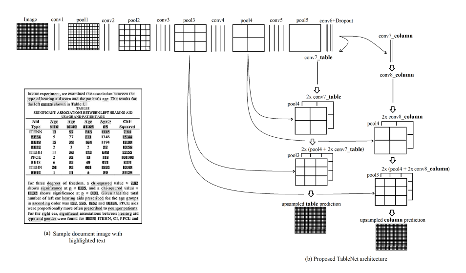

# Recreation_TableNet

This project is a recreation of the TableNet architecture, designed for detecting and extracting tables from document images. It includes implementations in Jupyter Notebooks, a trained model, and utility scripts for preprocessing and mask generation.

TableNet is a deep learning model tailored for table detection in document images. This repository offers an experimental recreation of the architecture, providing tools and scripts to facilitate table extraction tasks.

This is an implementation of the ICDAR 2019 paper:
**TableNet: Deep Learning model for end-to-end Table detection and Tabular data extraction from Scanned Document Images.**
Paper link: [https://arxiv.org/abs/2001.01469](https://arxiv.org/abs/2001.01469)

## Architecture

The model architecture is inspired by the original TableNet design, focusing on precise table boundary detection. An illustrative diagram of the architecture is shown below:



## Dataset

The dataset used for training and evaluation consists of scanned document images with annotated table regions.

You can download the dataset and pretrained weights from the following Google Drive link:  
[Dataset and Weights](https://drive.google.com/drive/folders/1aEOH19FVNjYKToUb-VY02XGMlDWnxvUi?usp=sharing)

## Repository Contents

- `TableNet.ipynb` : Primary Jupyter notebook demonstrating the implementation and evaluation of the TableNet model.
- `TableNet(Experimental).ipynb` : An experimental notebook exploring alternative approaches and configurations.
- `tablenet (2).ipynb` : Additional experiments and variations on the TableNet architecture.
- `generate_mask.py` : Python script for generating segmentation masks from annotated data.
- `saved_model.pb` : Serialized pre-trained TableNet model for inference.
- `extracted_table.csv` : Sample output showcasing extracted table data.
- `architecture.png` : Visual representation of the TableNet architecture.
- `Following Research Paper.pdf` : Reference paper detailing the original TableNet methodology.

## Getting Started

### Prerequisites

Ensure the following packages are installed:

- Python 3.6 or higher
- TensorFlow 2.x
- Jupyter Notebook
- NumPy
- OpenCV
- Pandas

### Installation

1. Clone the repository:
   ```bash
   git clone https://github.com/Mikdad-Rahman/Recreation_TableNet.git
   cd Recreation_TableNet
   ```

2. Install the required packages:
   ```bash
   pip install -r requirements.txt
   ```

   *Note: If `requirements.txt` is not available, install the libraries manually.*

### Usage

1. Open `TableNet.ipynb` using Jupyter Notebook.
2. Follow the steps to:
   - Load and preprocess the dataset
   - Generate masks using `generate_mask.py`
   - Train and evaluate the model
   - Perform inference on new images

## Results

Sample output is provided in `extracted_table.csv`. The recreated TableNet performs well in extracting tables from document images.

## Contributing

Contributions are welcome! Feel free to fork the repository and submit a pull request.

## Acknowledgements

This work is inspired by the original TableNet research. Refer to `Following Research Paper.pdf` and the original paper for more information.
